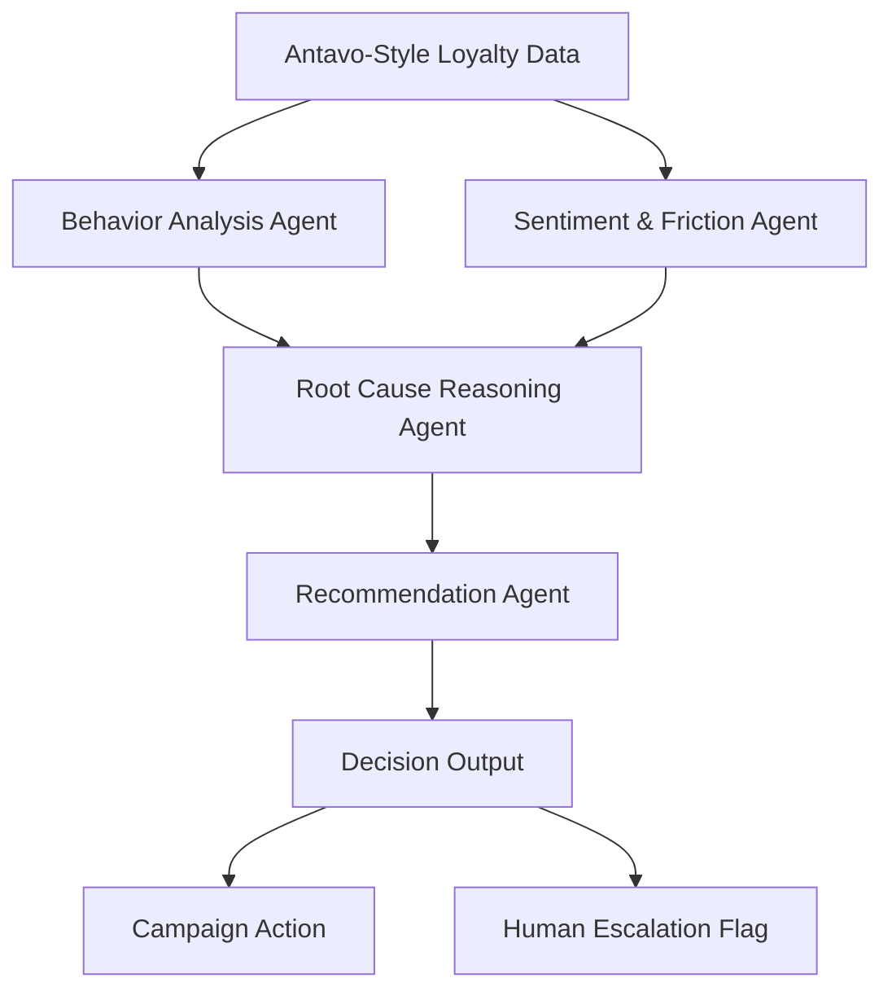

# 🧠 Agentic Loyalty Intelligence POC  
### Explainable, Multi-Agent Decision Intelligence for Enterprise Loyalty Platforms

This repository contains a **Proof of Concept (POC)** demonstrating how an **agentic AI layer** can be built **on top of Antavo-style loyalty data** to move beyond dashboards and rules into **explainable, actionable decision intelligence**.

The system is designed for **enterprise loyalty use cases** such as:
- Supermarkets & retail
- Fuel / oil companies (e.g. TotalEnergies-style programs)
- Banks and regulated financial institutions

---

## 🚀 What Problem This Solves

Most loyalty platforms can answer:
- *What happened?* (visits dropped, redemptions declined)

They struggle to answer:
- *Why did this customer disengage?*
- *What is the right action to take now?*
- *Should this be automated or escalated to a human?*

This POC addresses that gap by using **multiple specialized agents** that reason step-by-step over customer behavior and sentiment.

---

## 🧩 Solution Overview

This project implements an **Agentic Loyalty Intelligence Layer** that:

- Diagnoses customer disengagement using **behavioral signals**
- Enriches insights with **sentiment & friction context**
- Produces **human-readable root cause explanations**
- Recommends **next-best loyalty actions**
- Flags **human escalation** when automation should stop

Importantly, this system:
- **Enhances** existing loyalty platforms (e.g. Antavo)
- Does **not replace** core loyalty infrastructure
- Is **explainable by design**, not a black box

---

## 🏗️ High-Level Architecture

---

## 🤖 Agent Responsibilities

1️⃣ Behavior Analysis Agent

Analyzes structured loyalty data:

Spend trends

Visit frequency

Reward redemption patterns

Computes deviations from historical baselines

No LLM used (deterministic, auditable logic)

---
## 2️⃣ Sentiment & Friction Agent

Detects customer dissatisfaction signals such as:

Price sensitivity

Reward expiry frustration

Perceived lack of value

Adds qualitative context missing from raw metrics
---

## 3️⃣ Root Cause Reasoning Agent

Combines behavior + sentiment

Explains why disengagement is happening

Produces human-readable explanations

Designed for auditability and trust
---

## 4️⃣ Recommendation Agent

Decides the best next action, not just an insight

Tailors recommendations by:

Use case (fuel vs supermarket)

Customer value

Detected friction

Explicitly signals human-in-the-loop escalation

---
## 🔁 Orchestration Model

Uses custom sequential agent orchestration

Agents run in a deterministic order

Each agent consumes the structured output of the previous one

No autonomous planning or black-box behavior

This design is intentional to support:

Enterprise audit requirements

Predictable behavior

Easier migration to workflow engines later

---

## 🗄️ Vector Database Usage

This POC does not use a vector database.

Reason:

The problem is structured decisioning, not document retrieval

Loyalty data is tabular and event-driven

Vector databases can be added later if:

Call transcripts

Emails

Long-form complaints
need to be incorporated.

---

## 🏭 Production Readiness

In production, this system would:

Run agents as stateless services or functions

Be triggered by:

Batch jobs (daily / hourly)

Event-driven workflows

Integrate with:

CRM systems

Campaign execution engines

Human review queues

The Streamlit UI in this repo is for demo purposes only.
---

## 📈 Scalability

The architecture scales along three dimensions:

Customer Scale

Agents operate per-customer

Can be parallelized horizontally

Data Scale

Same logic applies to larger datasets

No retraining required

Use-Case Scale

Supermarket, fuel, banking reuse the same agents

Only data mappings and thresholds change
---

## 🧪 Demo Capabilities

The included demo UI allows:

Switching between supermarket and fuel use cases

Selecting individual customers

Viewing:

Behavior analysis

Sentiment & friction

Root cause explanation

Recommended action & escalation
---

##🔐 Key Design Principles

Explainability over prediction

Human-in-the-loop by default

Minimal complexity, maximum clarity

Enterprise-safe agent design
---

## 📌 Summary

This POC demonstrates how agentic AI can be applied responsibly to enterprise loyalty systems, enabling teams to move from reactive reporting to proactive, explainable decision-making.